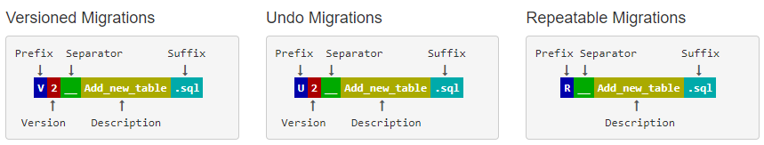
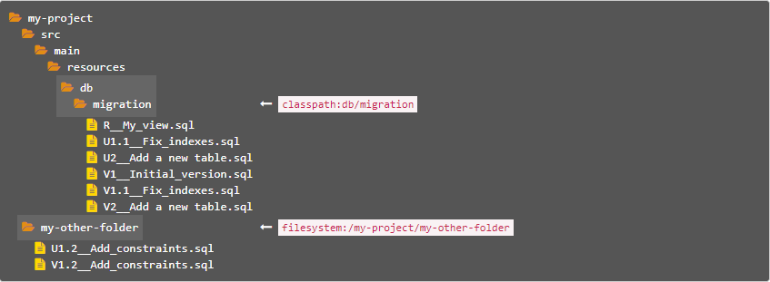

# Flyway 的使用笔记

**Flyway** 是独立于数据库的应用、管理并跟踪数据库变更的数据库版本管理工具。用通俗的话讲，**Flyway** 可以像 Git 管理不同人的代码那样，管理不同人的sql脚本，从而做到数据库同步。

这里主要是针对 **maven** 项目基于 SQL 的迁移使用笔记。

#### 命名规范

数据库迁移脚本命名规则为 `V<VERSION>__<NAME>.sql` （其中 <VERSION> 为版本号，如 1 或者 1.2），如下：
	


文件名由以下部分组成：

- **Prefix（前缀）**：`V`用于版本化的迁移， `U`用于撤消相同版本迁移， `R`用于可重复迁移
- **Version（版本）**：带点或下划线的版本可根据需要分隔尽可能多的部分（不适用于可重复的迁移）
- **Separator（分隔符）**：`__`（两个下划线）
- **Description（说明）**：下划线或空格将单词分开
- **Suffix（后缀）**：`.sql`

使用Flyway升级，flyway会自动创建一张历史记录表： `flyway_schema_history`。

这张表记录了每一次升级的记录，包括已经执行了哪些脚本，脚本的文件名，内容校验和，执行的时间和结果。

#### 发现迁移脚本

**Flyway** 可以在**文件系统**和 Java **类路径**上发现 SQL 迁移脚本。迁移脚本可以存在一个或多个目录中，可以通过 `locations` 属性进行设置。



在运行时，通过文件系统和Java类路径扫描**自动发现**基于SQL的新迁移。配置 `locations` 好要使用的SQL迁移后，只要它们符合配置的命名约定，Flyway就会自动选择任何新的SQL迁移。

此扫描是递归的。指定目录下非隐藏目录中的所有迁移也将被提取。

> 更多内容可以查看 [Flyway官方文档](https://flywaydb.org/documentation/migrations)

#### Maven 项目添加 Flyway 插件（通用）

* 在 **pom.xml** 中添加 Flyway 的插件

    ```xml
    <plugin>
        <groupId>org.flywaydb</groupId>
        <artifactId>flyway-maven-plugin</artifMactId>
        <version>6.1.3</version>
    </plugin>
    ```

* 通过命令执行

    ```bash
    mvn -Dflyway.url='jdbc:mysql://127.0.0.1:3306/testDB?useSSL=false' -Dflyway.user=root -Dflyway.password=root flyway:info
    ```

	如果不想在命令行中添加数据源信息，则需要在 Flyway 插件上配置好数据源信息，配置如下：
	
	
	```xml
    <plugin>
        <groupId>org.flywaydb</groupId>
        <artifactId>flyway-maven-plugin</artifMactId>
        <version>6.1.3</version>
        <configuration>
        	<driver>com.mysql.cj.jdbc.Driver</driver>
            <url>jdbc:mysql://127.0.0.1:3306/testDB?useSSL=false</url>
            <user>root</user>
            <password>root</password>
        </configuration>
    </plugin>
    ```

	这样的话，上面的命令就变成：
	
	```bash
    mvn flyway:info
    ```
	
* 常用命令

    |   命令    |                 说明                                   |
    | -------- | ------------------------------------------------------ |
    | migrate  | 这个命令会搜索默认的脚本目录，检测并根据结果选择执行升级脚本      |
    | info     | 这个命令显示指定schema的升级状态，当前的数据库的版本信息        |
    | repair   | 这个命令主要做了两件事，移除所有失败的迁移（升级），重置校验和    |
    | clean    | 这个命令会清除指定schema下所有的对象，包括table、view、triggers...，让schema变成空的状态  |
    | validate | 这个命令用于校验，范围包括已升级的脚本是否改名，已升级的脚本内容是否修改。所有针对已升级的脚本进行的改动都会导致校验失败。执行migrate会自动进行校验，如果失败将不会做任何的migrate。  |
    | baseline | 初始化schema_version表，并插入一条原始verion=1 |

    

#### Spring boot 项目集成 Flyway

* 在 **pom.xml** 中添加 Flyway 的依赖

```xml
<dependency>
	<groupId>org.flywaydb</groupId>
	<artifactId>flyway-core</artifactId>
</dependency>
```

* 在 **application.yml** 中添加 Flyway 配置

```yml
spring:
	flyway:
		## 打开flyway，使得每次程序启动的时候都会尝试去迁移数据。默认为 true
		#enabled: true
		## Encoding of SQL migrations (default: UTF-8)
		#encoding: UTF-8
		## 指定项目的迁移 sql 文件存放目录，默认为 classpath:db/migration
		locations: classpath:db/migration
		## 设定 flyway 的 metadata 表名, 默认为 flyway_schema_history
		table: flyway_schema_history
		## 对于已经存在的项目，数据库中存在数据，这个时候我们需要通过设置baseline告诉flyway，这个baseline及之前的sql脚本都不要执行了（否则会报重复的错误）
		baseline-on-migrate: true
		##  指定数据源，如果没有指定的话，默认使用 spring.datasource.url
		#url: jdbc:mysql://127.0.0.1:3306/testDB?useSSL=false
		## 如果这里明确指定了库名，那么在 spring.flyway.url 连接中指定的库名将无效
		#spring.flyway.schemas=base_db_flyway
		## 用户名，默认使用 spring.datasource.username
        #spring.flyway.user=root
        ## 密码，默认使用 spring.datasource.password
        #spring.flyway.password=123456
```

> **注意**：**Spring boot** 项目配置后 **Flyway** 后，每次启动服务，都会执行 **migrate** 命令。
> 如果出现已执行过的 sql 脚本有变更的情况，需要手动执行 `mvn flyway:repair` 命令。
> 因此 Spring boot 项目在集成 **Flyway** 时，一定要加上 **Flyway** 插件。


* 参考文档

	[Execute Flyway database migrations on startup](https://docs.spring.io/spring-boot/docs/1.4.0.RC1/reference/htmlsingle/#howto-execute-flyway-database-migrations-on-startup)


