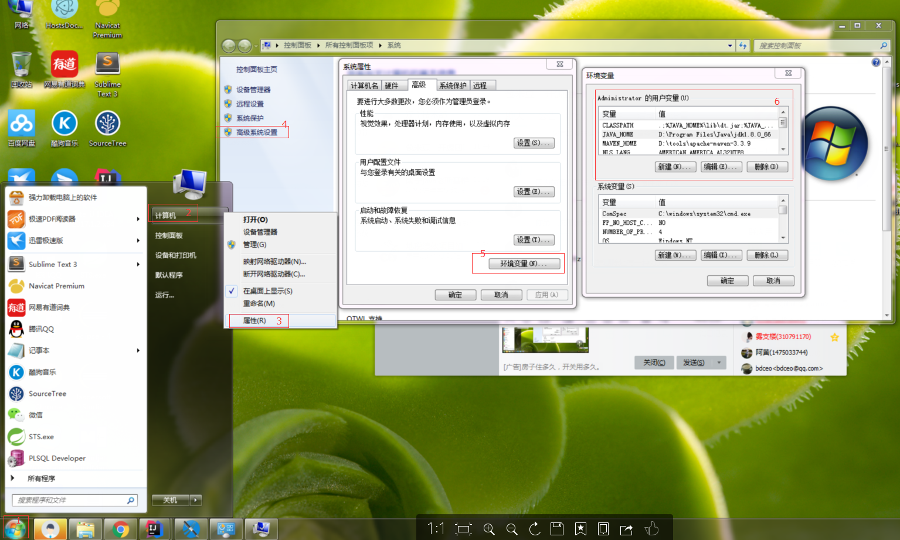

# WINDOWS下开发环境搭建

    该开发环境的搭建，主要针对于WINDOWS7 64位机器下的JAVA后端开发。
    如果喜欢用IDEA作为JAVA的开发工具，建议安装jdk8。

### 1、JAVA安装与环境变量配置

>安装过程略过（建议安装在D盘）

>JAVA的环境变量配置：

    在系统左下角点击“开始”按钮 -> 找的“计算机”右键选择“属性” -> 在弹出的窗口中点击“高级设置” -> 在弹出的“系统属性”的“高级”下点击“环境变量”

>如图：

>1、配置JAVA_HOME

    JAVA_HOME   D:\Program Files\Java\jdk1.8.0_66

>2、配置CLASSPATH

    CLASSPATH   .;%JAVA_HOME%\lib\dt.jar;%JAVA_HOME%\lib\tools.jar;

>3、配置PATH

    PATH        %JAVA_HOME%\bin;%JAVA_HOME%\jre\bin;

>4、验证环境

### 2、MAVEN安装与环境变量配置

>

### 3、ORACLE11g安装，及PLSQL安装与配置

>

### 4、MYSQL安装配置

>

### 5、安装Sublime Text3（个人喜好，可略过）

>请参照文章：[如何优雅地使用Sublime Text3](http://jeffjade.com/2015/12/15/2015-04-17-toss-sublime-text/)

### 6、修改HOST文件（为了用google）

>请参照开源项目[hosts](https://github.com/racaljk/hosts)。 
>如果有些网站还是不能访问，可找一些代理工具翻墙，这里推荐使用[蓝灯](https://github.com/getlantern/lantern)。 
>翻墙后可下载谷歌浏览器，方便做前端调试。

### 7、安装版本控制工具

>git客户端工具推荐使用[git](https://git-scm.com/download/win)或者[SourceTree](https://www.sourcetreeapp.com/) 
>svn

### 8、IDEA的安装与配置

>请下下载[IDEA](https://www.jetbrains.com/idea/download/download-thanks.html)，再进行安装。
>

