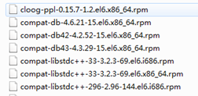
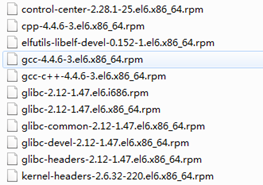
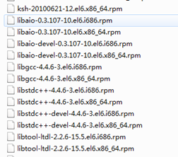
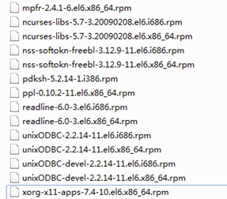
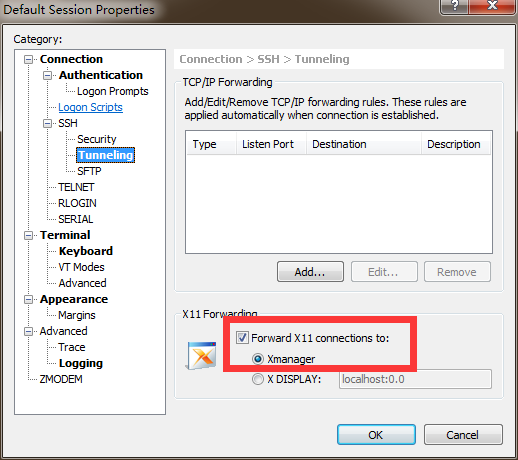

#Linux下Oracle 11G的安装过程

###一、配置Linux系统下Oracle的安装环境

######1、安装Java jdk

请参照：

[centos6.5系统下安装jdk1.7](../java/linux_jdk_install.md)

[Linux 下安装配置 JDK1.7](https://my.oschina.net/boltwu/blog/403555)

######2、安装前准备
	
从官网下载Oracle 11g安装包，根据Linux系统类型选择安装介质，我选择的是linux.x64_11gR2，它分为两个zip压缩包

从Linux系统安装光盘中找到 Oracle官方文档中确定要安装的包如下:

	binutils-2.17.50.0.6
	compat-libstdc++-33-3.2.3
	compat-libstdc++-33-3.2.3 (32 bit)
	elfutils-libelf-0.125
	elfutils-libelf-devel-0.125
	gcc-4.1.2
	gcc-c++-4.1.2
	glibc-2.5-24
	glibc-2.5-24 (32 bit)
	glibc-common-2.5
	glibc-devel-2.5
	glibc-devel-2.5 (32 bit)
	glibc-headers-2.5
	ksh-20060214
	libaio-0.3.106
	libaio-0.3.106 (32 bit)
	libaio-devel-0.3.106
	libaio-devel-0.3.106 (32 bit)
	libgcc-4.1.2
	libgcc-4.1.2 (32 bit)
	libstdc++-4.1.2
	libstdc++-4.1.2 (32 bit)
	libstdc++-devel 4.1.2
	make-3.81
	numactl-devel-0.9.8.x86_64
	sysstat-7.0.2

如果没有安装光盘的，可以在网站[http://rpm.pbone.net/](http://rpm.pbone.net/) 上找rpm的安装包，如果有不明白的so库文件可以在网站[http://pkgs.org/](http://pkgs.org/) 上查找。一般会需要安装一些相关依赖包：

######3、安装依赖包

下载依赖包后，复制到Linux系统中，使用命令

	rpm -ivh [路径]/*.rpm
	
进行安装。

######4、验证安装环境

查看内存大小

	grep MemTotal /proc/meminfo
	
查看交换空间

	grep SwapTotal /proc/meminfo

查看磁盘空间，Oracle 11g R2 x64企业版的磁盘空间要求4.35GB以上。

	df -h

######5、创建Oracle组和用户帐户

	groupadd oinstall
	groupadd dba
	useradd -g oinstall -G dba oracle
	passwd oracle
	
######6、配置内核参数

以root身份登录系统，根据用户指南配置以下参数。通过vi修改文件/etc/sysctl.conf：

	vi /etc/sysctl.conf
	
添加以下内容：

	# for oracle
	fs.aio-max-nr = 1048576
	fs.file-max = 6815744
	kernel.shmall = 2097152
	kernel.shmmax = 536870912
	kernel.shmmni = 4096
	kernel.sem = 250 32000 100 128
	net.ipv4.ip_local_port_range = 9000 65500
	net.core.rmem_default = 262144
	net.core.rmem_max = 4194304
	net.core.wmem_default = 262144
	net.core.wmem_max = 1048586
	
保存并退出vi，执行以下命令时参数生效:

	/sbin/sysctl -p

通过vi修改文件/etc/security/limits.conf

	vi /etc/security/limits.conf

添加以下内容:

	# for oracle
	oracle              soft    nproc   2047
	oracle              hard    nproc   16384
	oracle              soft    nofile  1024
	oracle              hard    nofile  65536
	oracle              soft    stack   10240

######7、创建Oracle Base目录:

	mkdir -p /u01/app/
	chown -R oracle:oinstall /u01/app/
	chmod -R 775 /u01/app/

######8、设置Oracle用户环境

切换到oracle用户

	su - oracle

编辑.bash_profile文件

	vi .bash_profile
	
添加以下内容：

	# For Oracle
	export DISPLAY=:0.0
	export TMP=/tmp;
	export TMPDIR=$TMP;
	export ORACLE_BASE=/u01/app/oracle;
	export ORACLE_HOME=$ORACLE_BASE/product/11.2.0/db_1;
	export ORACLE_SID=[数据库SID];
	export ORACLE_TERM=xterm;
	export PATH=/usr/sbin:$PATH;
	export PATH=$ORACLE_HOME/bin:$PATH;
	export LD_LIBRARY_PATH=$ORACLE_HOME/lib:/lib:/usr/lib;
	export CLASSPATH=
	$ORACLE_HOME/JRE:$ORACLE_HOME/jlib:$ORACLE_HOME/rdbms/jlib;
	
###二、安装Oracle软件与数据库

######1、安装Oracle软件

将Oracle安装文件解压缩到同一文件夹，linux.x64_11gR2_database_1of2.zip与linux.x64_11gR2_database_2of2.zip。

以oracle用户身份登录系统安装Oracle，为避免出现中文乱码，安装前可以执行export LANG=C，显示英文，

	$ export LANG=C
	$ cd database
	$ ./runInstaller
	
在安装时选择只安装Oracle软件。

######2、安装数据库

Oracle软件安装完后，需要执行命令netca配置监听器.

	$ netca
	
在图形界面中按提示配置监听器。
	
然后执行命令dbca安装数据库。

	$ dbca
	
在图形界面中按提示安装数据库就可以了。

需要注意的是想要显示图形界面在使用Xshell时必须选择勾选：

通过xhost命令控制添加访问权限

	xhost + ip
	
并使用**xclock** 命令验证

###三、测试运行安装的Oracle系统

数据库安装完后监听器与数据库实例就已启动。执行以下测试监听器与实例。

	$ lsnrctl stop
	$ lsnrctl start
	$ sqlplus /nolog
	SQL> connect / as sysdba;
	SQL> shutdown
	SQL> startup
	
执行其它SQL语句测试数据库。

