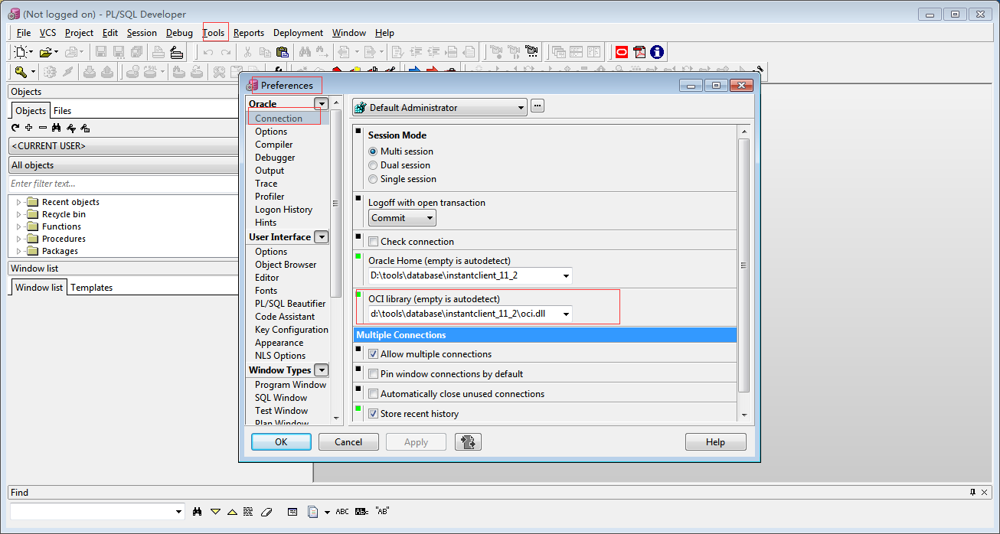

# WINDOWS7下plsql连接Oracle 64配置

>由于plsql只有32位的程序，因此安装后无法直接连接oracle11g_win64的服务端， plsql需要通过一个32位的客户端程序，才可以访问，这里我们主要讲怎么配置它。

### 1、下载32位Oracle客户端

>假设我们已经安装好oracle11g_64和plsql，我们需要去oracle的官方下载一个32位的[客户端程序]( http://download.oracle.com/otn/nt/instantclient/112030/instantclient-basic-nt-11.2.0.3.0.zip)，下载需要登录，得先在Oracle注册账号才能下载。

>下载完成后可解压在你喜欢的路径，（我解压后的路径是D:\tools\database\instantclient_11_2）。

### 2、修改PLSQL配置

>在Tools -> Preferences -> Connection -> OCI library中，输入d:\tools\database\instantclient_11_2\oci.dll

如下图

### 3、添加环境变量

系统变量中添加2个：

>第一个是指向TNS文件所在目录的，这个目录是你安装的64位版本Oracle的TNS文件所在目录。TNS文件就是保存了连接信息的文件。 
 
    TNS_ADMIN  值： E:\app\Administrator\product\11.2.0\dbhome_1\NETWORK\ADMIN 

>个是指定数据库使用的编码。如果不设置成以下值，那么连接上数据库后，你看到的所有中文的内容将会是乱码，都是一堆问号。

    NLS_LANG  值：SIMPLIFIED CHINESE_CHINA.ZHS16GBK

### 4、注意事项

>修改plsql的配置和添加环境变量之后，都要先关掉plsql再打开才能生效

### 参考文章

[http://www.voidcn.com/blog/fyhjuyol/article/p-3527038.html](http://www.voidcn.com/blog/fyhjuyol/article/p-3527038.html)
